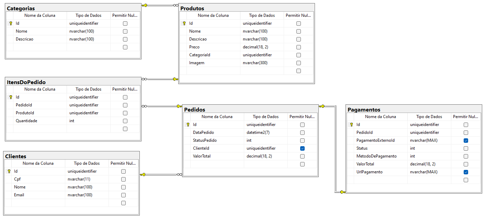
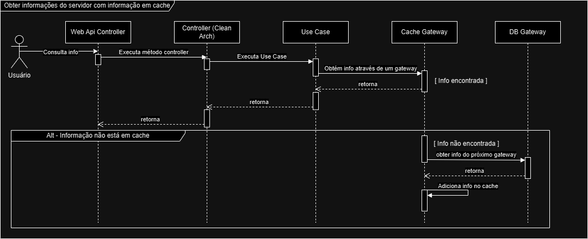

# fast-order


É uma implementação dos domínios de negócio de uma lanchonete utilizando clean-architecture, disponibilizando um Driven webapi.

O projeto implementa os fluxos descritos no [Event Storming (miro board)](https://miro.com/app/board/uXjVK5PtxF0=/?share_link_id=847017542278) 

Para maiores detalhes gravamos um [video de apresentação com o fluxo de execução esperado](https://www.youtube.com/watch?v=2OUjhxdt0Hk)


## Pré-requisitos
- Docker
    - [Instruções para instalar o Docker - Windows](https://docs.docker.com/desktop/install/windows-install/)   
    - [Instruções para instalar o Docker - Linux](https://docs.docker.com/desktop/install/linux-install/)
    - [Instruções para instalar o Docker - MacOs](https://docs.docker.com/desktop/install/mac-install/)
- Docker Compose
    - [Instruções para instalar o Docker Compose](https://docs.docker.com/compose/install/)
- Kubernetes
  - [Habilitar Kubernetes com Docker Desktop](https://docs.docker.com/desktop/kubernetes/)

## Executando

1. Abra o "Docker Desktop"

2. Clone o repositório:
   ```bash
   git clone https://github.com/8SOAT-Team/Fast-Order.git

3. Acesse a pasta de manifestos
   ```bash
   cd Fast-Order
   cd manifestos

4. Aplique os arquivos ".yaml" utilizando o kubectl
    ```bash
    kubectl apply -f fo-configmap.yaml,fo-pvc.yaml,fo-svc.yaml,fo-deployment.yaml,fo-hpa.yaml,fo-db-svc.yaml,fo-db-deployment.yaml

5. Aguarde os deployments estarem disponíveis     
    ```bash
    kubectl get deployments --watch

## Documentação da API
Disponibilizamos uma [collection do postman](/docs/postman/Postech8SOAT.FastOrder.WebAPI.postman_collection.json) com todos os endpoints utilizados na apresentação.

## Uso
As APIs devem estar rodando em http://localhost:31500/

## Diagrama da Arquitetura de Infraestrutura


## Modelo de Entidade-Relacionamento (MER)


## Diagrama de Fluxo Utilizando Cache


## Utilização de um Banco de dados intermediário como cache (Redis)

Devido a existência de dados que não são alteráveis, ou não são alterados com frequência, notamos que o desempenho da aplicação pode ser otimizado ao implementar a consulta em um banco de dados intermediário de cache, onde escolhemos o Redis, que é um banco de dados do tipo chave valor fortemente estabelecido no mercado. Contando com suporte de bibliotecas e da comunidade em diversas tecnologias para integração e resolução de problemas.
Notamos a queda no tempo de resposta de aproximadamente 50% dos tempos de resposta sem o cache.

Dados como informações do cliente, cadastro de produtos, pagamentos efetuados e algumas informações do pedido que não sofrem alterações ou poucas ao serem adicionadas no cache (ou tendo o cache invalidado), otimizamos não apenas a leitura, mas a disponibilidade do recurso do banco de dados principal para outras leituras que não podem estar em cache e novas gravações.

## Licença
Este projeto está licenciado sob a Licença MIT - veja o arquivo LICENSE para mais detalhes.

## Autores
### Fiap turma 8SOAT - Grupo 7

- André Bessa - RM357159
- Fernanda Beato - RM357346
- Felipe Bergmann - RM357042
- Gilberto Loubach - RM357416
- Victor Oliver - RM357451
